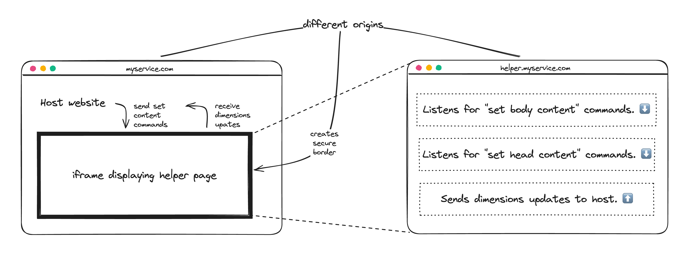

<p align="center">
    <br>
    <br>
    
    <h1 align="center">build an<br>HTML sandbox</h1>
</p>

<p align="center">
  
  <a href="https://www.npmjs.com/package/@perspective-software/cross-origin-html-embed">
    
  </a>
  <br>
  <br>
</p>

# Cross-Origin HTML Embed

This library offers you a **toolkit** to build HTML "sandboxes" where
you can run/display arbitrary (e.g. user provided) HTML in – securely.

We make use of iframes and cross-origin principles.



# Table of contents

<!-- TOC -->
* [Cross-Origin HTML Embed](#cross-origin-html-embed)
* [Table of contents](#table-of-contents)
* [Concept](#concept)
  * [Expectations](#expectations)
  * [Cross-origin](#cross-origin)
  * [Hosting](#hosting)
  * [Helper HTML for dynamic content](#helper-html-for-dynamic-content)
  * [Lifecycle](#lifecycle)
* [Library](#library)
* [Installation](#installation)
* [Usage](#usage)
  * [Server side](#server-side)
  * [Client side](#client-side)
* [Scaling nr. of sandboxes](#scaling-nr-of-sandboxes)
  * [Wildcard subdomains](#wildcard-subdomains)
  * [Subdomain prefixing](#subdomain-prefixing)
* [Examples](#examples)
* [Features](#features)
* [Development](#development)
  * [Setup](#setup)
  * [Running tests](#running-tests)
  * [Build](#build)
  * [Lint](#lint)
  * [Publish](#publish)
<!-- TOC -->

# Concept

## Expectations

Custom code that is being run/displayed (inside our sandboxes) __must not be able__ to
- access the LocalStorage of our website/web-app
- access the SessionStorage of our website/web-app
- intercept network requests of our website/web-app
- register service-workers for the scope of our website/web-app
- interact with our site/app in general
- ... and so on ...

## Cross-origin

Imagine we have a host site and an iframe inside it.

If the origin of the host site and the origin of the iframe are different
(cross-origin), HTML displayed/run inside the iframe has the limitations
we have outlined as our expectations. Nice.

## Hosting

That one is pretty simple. Imagine your app runs on `myservice.com`.

Then we need to serve our content only on a different origin. For example:
- `anotherservice.com`
- `sandbox.myservice.com`

We do want to serve/embed dynamic HTML. How can we do that **without needing to redeploy these cross-origin locations**?

## Helper HTML for dynamic content

The solution: A helper HTML page. This helper page needs to be served
on the remote origin.

The page comes with an  interface to communicate with the host page via `postMessage`.

It listens for the following commands to allows the host to modify the iframe page:
- set `<head>` content
- set `<body>` content

Additionally, the HTML page sends dimensions updates to the host.
This way, the host can adjust the size of the iframe to show
the custom HTML's content as a whole.

## Lifecycle

To display custom HTML securely in such a "sandbox", the order is:
1. create iframe to load the helper HTML page
2. set up "dimensions update" listener that sets the iframe height accordingly
3. send "set content" commands to iframe helper page (head and/or body)

# Library

This library implements the concept explained above and allows you to
build this setup yourself.

It covers two sides:
- server: generate the helper page HTML
- client: handle communication between host and iframe
  - set head content
  - set body content
  - receive dimensions updates

# Installation

npm:
```bash
npm add @perspective-software/cross-origin-html-embed
```

yarn:
```bash
yarn add @perspective-software/cross-origin-html-embed
```

pnpm:
```bash
pnpm add @perspective-software/cross-origin-html-embed
```

Bun:
```bash
bun add @perspective-software/cross-origin-html-embed
```

# Usage

First you need to set up your helper page HTML.

After that, you can make use of that on the client side.

## Server side

To set up the helper page HTML, read the server side docs: [Server Docs 🔗](./docs/server/README.md)

## Client side

To communicate with the helper page iframes successfully, check out the client docs: [Client Docs 🔗](./docs/client/README.md)

## Static HTML Generator

In case you want to rather host a static helper page HTML, you can also use the static side generator: [Static HTML Generator 🔗](https://cross-origin-html-embed-static-html-generator.vercel.app/) 

# Scaling nr. of sandboxes

Now imagine, you want to create an infinite number of such sandbox.
Each shall have a unique remote origin.

Why? Because you may want to create one sandbox per code snippet.

How? With a wildcard subdomain.

## Wildcard subdomains

Imagine you connect your the domain `sandbox.myservice.com` and the wildcard subdomain `*.sandbox.myservice.com` to the helper page.

Now imagine your HTML snippets have unique IDs.

Then you can easily create a unique sandbox by setting the iframe's src to `https://${htmlSnippet.id}.sandbox.myservice.com`.

You just need to set up your helper page hosting accordingly.

## Subdomain prefixing

This is an extension of the wildcard subdomains. You may specify different embed areas, such as `backoffice` and `blog`.

You could define two base URLs that will later be finalized with prefixes:
- `https://{prefix}---backoffice.sandbox.myservice.com`
- `https://{prefix}---blog.sandbox.myservice.com`

You can then set the `prefix` based on snippet IDs, blog IDs, or even a combination of both.

Thanks to the wildcard subdomain you have total flexibility.

# Examples

We advise you to have a look at both the [Server Docs 🔗](./docs/server/README.md) and the [Client Docs 🔗](./docs/client/README.md).

They both link to server and client examples.

# Features

- fully tested
- written in TypeScript
- tree-shakable
- CJS support
- MJS/ESM support

# Development

Only for developers of the organization `Perspective-Software`.

## Setup

```bash
nvm use
node install
```

## Running tests

```bash
npm run test
```

With coverage:

```bash
npm run test:cov
```

## Build

```bash
npm run build
```

## Lint

```bash
npm run lint:fix
```

To just check the code:

```bash
npm run lint:check
```

## Publish

NPM
- Increment `package.json` version.
- Create a `CHANGELOG` entry.
- Publish to npm.

```bash
npm publish
```

_(Runs tests, eslint and prettier before the actual publish step.)_

GitHub
- Commit changes.
- Create git tag.
- Push commits.
- Push tags.

